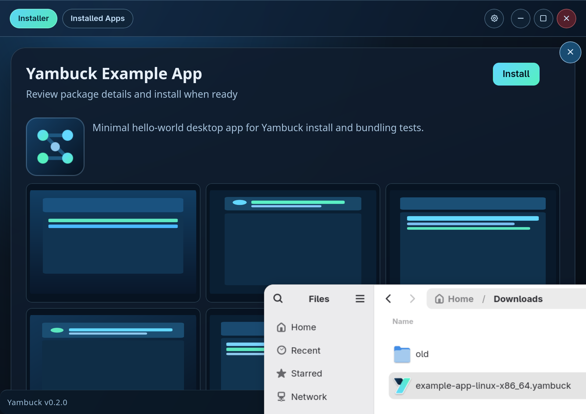

<div align="center">


# Yambuck

**A Linux-first installer that makes direct-download apps feel simple and predictable.**

[](https://github.com/yambuck/yambuck)
[](https://github.com/yambuck/yambuck)
[](https://github.com/yambuck/yambuck)
[](https://github.com/yambuck/yambuck)
[](LICENSE)

</div>

Yambuck exists because Linux app installs are still fragmented when software is distributed as direct downloads. Users are often forced to choose between `.deb`, `.rpm`, `AppImage`, and architecture-specific builds before they can even begin. A `.deb` may work on Debian-based systems but not Fedora; an `.rpm` is the reverse. The result is too many decisions up front and an install experience that changes from system to system.

Yambuck is built for two groups: small developers who want direct distribution without the overhead of distro repositories, and users who want a dead-simple install path regardless of distro. The goal is one package format and one guided flow, with a richer preview than typical downloaded package flows — including app metadata, icon, and screenshots before install. Install is simple, and uninstall is just as simple from the same place.

For me, this started while I was building small Linux GUI utilities to make my own move from Windows easier — including a dictation app and a GUI tool for configuring my USB audio DAC. The more I shared those tools, the more obvious the problem became: people should not need distro-specific packaging knowledge just to install a simple app, especially if they are new to Linux. Even though `.deb` is common and often the best option available today, it still does not deliver a clean, consistent install experience across every distro and desktop setup. Yambuck is my attempt to close that gap with one predictable, beginner-friendly install and uninstall flow for direct-download Linux software.

At a glance, the flow is:

- download a `.yambuck` package
- open it in a guided GUI
- review app details and screenshots
- choose install scope
- install and manage it cleanly from one place
- uninstall just as simply

## Quick Start

**Install Yambuck:**

```bash
curl --proto '=https' --tlsv1.2 -sSf https://yambuck.com/install.sh | bash
```

Uninstall Yambuck (safe default, keeps managed apps):

```bash
curl --proto '=https' --tlsv1.2 -sSf https://yambuck.com/uninstall.sh | bash
```

Full purge (remove Yambuck and Yambuck-managed apps):

```bash
curl --proto '=https' --tlsv1.2 -sSf https://yambuck.com/uninstall.sh | bash -s -- --purge-managed-apps --yes
```

## Current Status

Yambuck is in alpha preview with a working end-to-end prototype flow and active hardening.

Today, the active product surface is GUI-first (`yambuck-gui`), with CLI planned as a secondary interface.

Reference package for exploratory testing: `example-app.yambuck` from the latest release.

## What Works Today

- package inspection and rich preview
- guided install flow with scope selection (`Just for me` and `All users`)
- installed-apps management and uninstall flow
- update feed wiring and in-app update checks
- ownership-aware install tracking for deterministic management behavior

## Screenshots



See the full screenshot gallery: `docs/screenshots/index.html`

## Where to Look Next

- Product direction and guardrails: `docs/PRODUCT_CONTEXT.md`
- Installer/runtime spec: `docs/SPEC.md`
- `.yambuck` packaging spec: `docs/PACKAGE_SPEC.md`
- Current work queue: `TODO.md`

## Useful Dev Commands

- Run GUI app with hot reload: `npm --prefix apps/yambuck-gui run tauri dev`
- Run frontend only: `npm --prefix apps/yambuck-gui run dev`
- Build frontend bundle: `npm --prefix apps/yambuck-gui run build`
- Check Rust/Tauri compile health: `cargo check --manifest-path apps/yambuck-gui/src-tauri/Cargo.toml`
- Build example package: `./scripts/build-example-app-yambuck.sh`
- Run example smoke flow: `./scripts/smoke-example-app.sh`
- Build release artifact + checksum: `./scripts/package-bootstrap-artifact.sh`
- Prepare full release bundle: `./scripts/release-all.sh --version 0.1.23`

## Project Layout

- `crates/yambuck-core`: package parsing, install/uninstall, metadata, verification
- `apps/yambuck-gui`: installer and installed-apps experience
- `apps/example-app`: reference app used to generate/validate the example `.yambuck` package
- `yambuck-cli`: planned secondary interface

## Brand Files

- `assets/branding/yambuck-icon-app.svg`: app icon source with background
- `assets/branding/yambuck-icon-mark.svg`: docs/web mark
- Regenerate Tauri icons: `npm --prefix apps/yambuck-gui run tauri icon src-tauri/icons/icon-source.svg`
