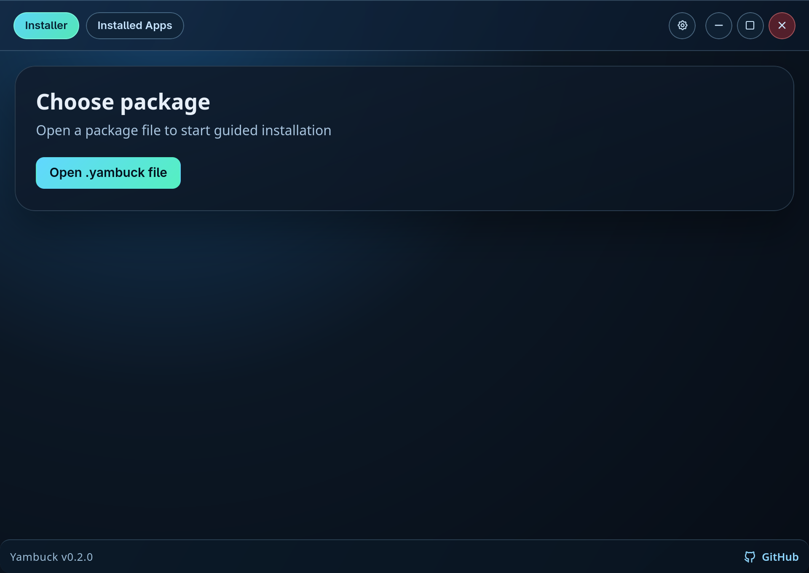

<div align="center">


# Yambuck

**A Linux-first installer that makes direct-download apps feel simple and predictable.**

[](https://github.com/jackbrumley/yambuck)
[](https://github.com/jackbrumley/yambuck)
[](https://github.com/jackbrumley/yambuck)
[](https://github.com/jackbrumley/yambuck)
[](LICENSE)

</div>

I built Yambuck because Linux app installation is still harder than it should be for normal users, especially when apps are distributed through direct downloads instead of app stores.

I wanted a flow that feels obvious:

- download a `.yambuck` package
- open it in a guided GUI
- review app identity and trust state
- choose install scope
- install and manage it cleanly from one place

If Yambuck says install succeeded, it should be installed, launchable, and clearly manageable until you uninstall it.

## Quick Start

Install Yambuck:

```bash
curl -fsSL https://yambuck.com/install.sh | bash
```

Uninstall Yambuck (safe default, keeps managed apps):

```bash
curl -fsSL https://yambuck.com/uninstall.sh | bash
```

Full purge (remove Yambuck and Yambuck-managed apps):

```bash
curl -fsSL https://yambuck.com/uninstall.sh | bash -s -- --remove-all-apps --yes
```

## Current Status

Yambuck is in alpha preview with a working end-to-end prototype flow and active hardening.

Today, the active product surface is GUI-first (`yambuck-gui`), with CLI planned as a secondary interface.

Reference package for exploratory testing: `example-app-linux-x86_64.yambuck` from the latest release.

## What Works Today

- package inspection and rich preview
- guided install flow with scope selection (`Just for me` and `All users`)
- installed-apps management and uninstall flow
- update feed wiring and in-app update checks
- ownership-aware install tracking for deterministic management behavior

## Screenshots



Full end-to-end gallery (13 screenshots): `docs/screenshots/index.html`

Flow covered in the gallery:

1. Choose package
2. Package selected in GNOME Files
3. Package details
4. Package details with technical metadata
5. Trust and verification
6. License agreement
7. License text dialog
8. Install scope
9. Install complete
10. Launched example app
11. Installed apps list
12. Installed app details
13. Installed app technical details

## Read Next

- Product intent and governance: `docs/PRODUCT_CONTEXT.md`
- Runtime/application contract: `docs/SPEC.md`
- Package authoring contract (`.yambuck`): `docs/PACKAGE_SPEC.md`
- Active open work queue: `TODO.md`

## Developer Commands

- Start Tauri app with Vite HMR: `npm --prefix apps/yambuck-gui run tauri dev`
- Start frontend-only dev server: `npm --prefix apps/yambuck-gui run dev`
- Build frontend bundle: `npm --prefix apps/yambuck-gui run build`
- Check Rust/Tauri compile status: `cargo check --manifest-path apps/yambuck-gui/src-tauri/Cargo.toml`
- Build example package: `./scripts/build-example-app-yambuck.sh`
- Run example smoke flow: `./scripts/smoke-example-app.sh`
- Build release artifact and checksum: `./scripts/package-bootstrap-artifact.sh`
- Prepare full release bundle: `./scripts/release-all.sh --version 0.1.23`

## Architecture

- `crates/yambuck-core`: package parsing, install/uninstall, metadata, verification
- `apps/yambuck-gui`: installer and installed-apps experience
- `apps/example-app`: downloadable reference app used to generate and validate the example `.yambuck` package
- `yambuck-cli`: planned secondary interface

## Brand Assets

- `assets/branding/yambuck-icon-app.svg`: app icon source with background
- `assets/branding/yambuck-icon-mark.svg`: mark for docs and web surfaces
- Regenerate Tauri icon outputs: `npm --prefix apps/yambuck-gui run tauri icon src-tauri/icons/icon-source.svg`
